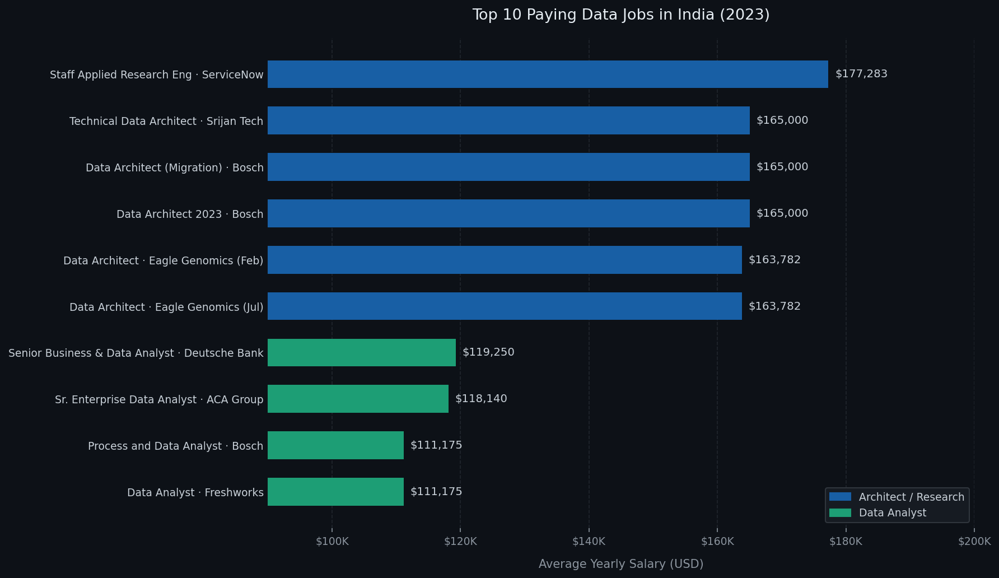
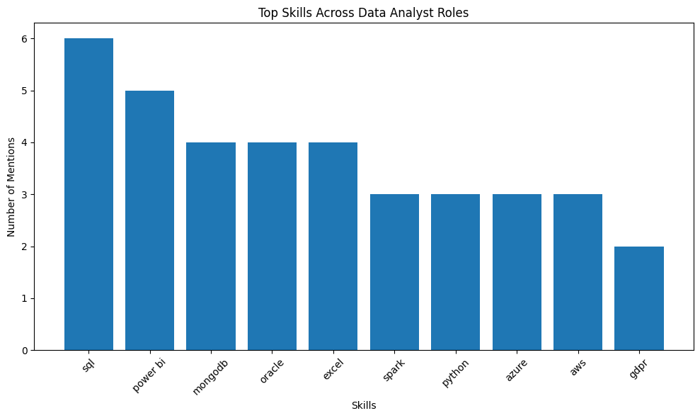

# Introduction
📊 In this project, I dive into the data job market Focusing on data analyst roles in India, this project explores 💰 top-paying jobs, 🔥 in-demand skills, and 📈 where high demand meets high salary in data analytics.

🔍 SQL queries? Check them out here: [project_sql folder](/project_sql/)

# Background
Built alongside Luke Barousse's SQL Course as a hands-on learning project. I used the course as a foundation but wrote my own queries and shaped the analysis around what I wanted to find out - specifically what skills and roles command the highest salaries for data analysts in India.

Data hails from Luke Barousse's [SQL Dataset](https://lukebarousse.com/sql). It's packed with insights on job titles, salaries, locations, and essential skills.

### The questions I wanted to answer through my SQL queries were:

1. What are the top-paying data analyst jobs in India?
2. What skills are required for these top-paying jobs?
3. What skills are most in demand for data analysts in India?
4. Which skills are associated with higher salaries?
5. What are the most optimal skills to learn?

# Tools I Used
For my deep dive into the data analyst job market, I harnessed the power of several key tools:

- **SQL:** The backbone of my analysis, allowing me to query the database and unearth critical insights.
- **PostgreSQL:** The chosen database management system, ideal for handling the job posting data.
- **Visual Studio Code:** My go-to for database management and executing SQL queries.
- **Git & GitHub:** Essential for version control and sharing my SQL scripts and analysis, ensuring collaboration and project tracking.

# The Analysis
Each query for this project aimed at investigating specific aspects of the data analyst job market in India. Here’s how I approached each question:

### 1. Top Paying Data Analyst Jobs in India
To identify the highest-paying roles, I filtered data analyst positions by average yearly salary and location, focusing on jobs based in India. This query highlights the high paying opportunities in the field.

```sql
SELECT
    job_id,
	job_title,
	job_location,
	job_schedule_type,
	salary_year_avg,
	job_posted_date,
	company_dim.name AS company_name
FROM
    job_postings_fact
LEFT JOIN company_dim ON job_postings_fact.company_id = company_dim.company_id
WHERE 
    job_title_short = 'Data Analyst' AND
    job_location LIKE '%India' AND
    salary_year_avg IS NOT NULL
ORDER BY 
	salary_year_avg DESC
LIMIT 10;  
```
Here's the breakdown of the top data analyst jobs in 2023:
- **Architect roles dominate the top:** Data Architect and Research Engineer roles from companies like ServiceNow, Bosch, and Eagle Genomics command salaries between $163K–$177K — significantly above the rest.
- **Clear two-tier structure:** There's a visible salary gap between the top-paying architect/research roles ($163K–$177K) and senior analyst roles ($111K–$119K), suggesting specialization pays heavily.
- **Bosch is a top payer:** Bosch Group appears three times in the top 10 — for Data Architect and Process & Data Analyst roles — making it a notable employer in the Indian data market.


*Bar graph visualizing the salary for the top 10 salaries for data analysts in India; Claude generated this graph from my SQL query results*

### 2. Skills for Top Paying Jobs
To understand what skills are required for the top-paying jobs, I joined the job postings with the skills data, providing insights into what employers value for high-compensation roles.
```sql
WITH top_paying_jobs AS (
    SELECT
        job_id,
        job_title,
        job_location,
        salary_year_avg,
        company_dim.name AS company_name
    FROM
        job_postings_fact
    LEFT JOIN company_dim ON job_postings_fact.company_id = company_dim.company_id
    WHERE 
        job_title_short = 'Data Analyst' AND
        job_location LIKE '%India' AND
        salary_year_avg IS NOT NULL
    ORDER BY salary_year_avg DESC
    LIMIT 10
)

SELECT 
    top_paying_jobs.*,
    skills_dim.skills
FROM
    top_paying_jobs
INNER JOIN skills_job_dim ON top_paying_jobs.job_id = skills_job_dim.job_id
INNER JOIN skills_dim ON skills_job_dim.skill_id = skills_dim.skill_id
ORDER BY
    salary_year_avg DESC;
```
Here's the breakdown of the most demanded skills for the top 10 highest paying data analyst jobs in India:
- **SQL** is the most demanded skill and appeared 6 times. This confirms SQL is still the core requirement for analytics jobs.
- **Power BI** is extremely valuable and appeared 5 times
- ***MongoDB, Oracle & Excel** all appeared 4 times.
Other skills like **Python**, **Spark**, **AWS**, and **Azure** show varying degrees of demand in the Indian job market.


*Bar graph visualizing the count of skills for the top 10 paying jobs for data analysts in India; ChatGPT generated this graph from my SQL query results*

### 3. In-Demand Skills for Data Analysts in India

This query helped identify the skills most frequently requested in job postings, directing focus to areas with high demand.

```sql
SELECT
    skills_dim.skills,
    COUNT(*) AS demand_count
FROM
    job_postings_fact
INNER JOIN skills_job_dim ON job_postings_fact.job_id = skills_job_dim.job_id
INNER JOIN skills_dim ON skills_job_dim.skill_id = skills_dim.skill_id
WHERE 
    job_title_short = 'Data Analyst' AND
    job_location LIKE '%India'
GROUP BY skills
ORDER BY demand_count DESC
LIMIT 5;
```
Here's the breakdown of the most demanded skills for data analysts in 2023
- **SQL** and **Excel** remain fundamental, emphasizing the need for strong foundational skills in data processing and spreadsheet manipulation.
- **Programming** and **Visualization Tools** like **Python**, **Tableau**, and **Power BI** are essential, pointing towards the increasing importance of technical skills in data storytelling and decision support.

| Skill     | Demand Count |
|------------|--------------|
| SQL        | 2561 |
| Python     | 1802 |
| Excel      | 1718 |
| Tableau    | 1346 |
| Power BI   | 1043 |

*Table of the demand for the top 5 skills in data analyst job postings in India*

### 4. Skills Based on Salary
Exploring the average salaries associated with different skills revealed which skills are the highest paying.
```sql
SELECT
    skills_dim.skills,
    ROUND(AVG(salary_year_avg), 0) AS average_salary
FROM
    job_postings_fact
INNER JOIN skills_job_dim ON job_postings_fact.job_id = skills_job_dim.job_id
INNER JOIN skills_dim ON skills_job_dim.skill_id = skills_dim.skill_id
WHERE 
    job_title_short = 'Data Analyst' AND
    salary_year_avg IS NOT NULL
  AND job_location LIKE '%India'
GROUP BY skills
ORDER BY average_salary DESC
LIMIT 25;
```
Here's a breakdown of the results for top paying skills for Data Analysts:

- **Big Data & Data Engineering Skills Dominate:** Technologies such as PySpark, Spark, Hadoop, Kafka, Scala, and Databricks are associated with the highest salaries, 
- **Database & Infrastructure Expertise is Highly Valued:** Skills including PostgreSQL, MySQL, MongoDB, Neo4j, Linux, Bash, and Shell indicate that organizations increasingly reward analysts who can work with databases, server environments, and automated workflows.
- **Cloud & Modern Analytics Platforms Drive Higher Salaries:** Tools such as Snowflake, Airflow, and Databricks demonstrate the importance of cloud-native analytics
- **Advanced Analytics & Visualization Skills Remain Important:** Pandas, Matplotlib, and DAX appear among top-paying skills, showing that organizations value strong analytical processing, data visualization, and business intelligence capabilities.

| Skills      | Average Salary |
|-------------|----------------|
| PySpark     | 165000 |
| GitLab      | 165000 |
| PostgreSQL  | 165000 |
| Linux       | 165000 |
| MySQL       | 165000 |
| Neo4j       | 163782 |
| GDPR        | 163782 |
| Airflow     | 138088 |
| MongoDB     | 135994 |
| Scala       | 135994 |

 *Table of the average salary for the top 10 paying skills for data analysts in India*

 ### 5. Most Optimal Skills to Learn

Combining insights from demand and salary data, this query aimed to pinpoint skills that are both in high demand and have high salaries, offering a strategic focus for skill development based on skills and jobs in India.

```sql
SELECT 
    skills_dim.skill_id,
    skills_dim.skills,
    COUNT(skills_job_dim.job_id) AS demand_count,
    ROUND(AVG(job_postings_fact.salary_year_avg), 0) AS average_salary
FROM job_postings_fact
INNER JOIN skills_job_dim ON job_postings_fact.job_id = skills_job_dim.job_id
INNER JOIN skills_dim ON skills_job_dim.skill_id = skills_dim.skill_id
WHERE
    job_title_short = 'Data Analyst'
    AND salary_year_avg IS NOT NULL
    AND job_location LIKE '%India'
GROUP BY
    skills_dim.skill_id
HAVING
    COUNT(skills_job_dim.job_id) >=5
ORDER BY
    average_salary DESC,
    demand_count DESC
LIMIT 25;
```

| Skill      | Demand Count | Average Salary |
|------------|--------------|----------------|
| Spark      | 11 | 118332 |
| Hadoop     | 5  | 113276 |
| Power BI   | 17 | 109832 |
| Flow       | 6  | 104751 |
| Oracle     | 11 | 104260 |
| PowerPoint | 10 | 102678 |
| Redshift   | 5  | 101315 |
| Looker     | 10 | 98815 |
| Azure      | 15 | 98570 |
| Python     | 36 | 95933 |
| AWS        | 12 | 95333 |
| Tableau    | 20 | 95103 |
| SQL        | 46 | 92984 |
| SQL Server | 5  | 89120 |
| Excel      | 39 | 88519 |
| R          | 18 | 86609 |
| Word       | 10 | 83266 |


The table above highlights the most optimal skills for Data Analysts in India based on both demand count and average salary. The analysis combines market demand with compensation trends to identify skills that offer strong career opportunities and high earning potential.

- The results show that technical skills such as **Spark**, **Hadoop**, **Azure**, **AWS**, **Python**, and **SQL** continue to dominate the analytics industry. 
- Business intelligence and visualization tools including **Power BI**, **Tableau**, and **Looker** also maintain strong demand across organizations.

Overall, the analysis suggests that employers increasingly value professionals who combine:
 - data analysis,
 - programming,
 - cloud technologies,
 - and business intelligence capabilities.

# What I Learned

Throughout this project, I've recharged my SQL toolkit with some serious firepower:

- **🧩 Complex Query Crafting:** Mastered the art of advanced SQL, merging tables like a pro and wielding WITH clauses for temp table maneuvers.
- **📊 Data Aggregation:** Got cozy with GROUP BY and turned aggregate functions like COUNT() and AVG() into my data-summarizing sidekicks.
- **💡 Analytical Thinking:** Leveled up my real-world puzzle-solving skills, turning questions into actionable, insightful SQL queries.

# Conclusions

### Insights
From the analysis, several general insights emerged:

1. **Top-Paying Data Analyst Jobs in India**: The highest-paying jobs for data analysts in India offer a wide range of salaries, the highest at nearly $180000 i.e ₹1,70,91,000 !
2. **Skills for Top-Paying Jobs**: High-paying data analyst jobs require advanced proficiency in SQL, suggesting it’s a critical skill for earning a top salary.
3. **Most In-Demand Skills**: SQL is also the most demanded skill in the data analyst job market in India, thus making it essential for job seekers.
4. **Skills with Higher Salaries**: Specialized skills, such as PySpark and GitLab, are associated with the highest average salaries, indicating a premium on niche expertise.
5. **Optimal Skills for Job Market Value**: SQL leads in demand and offers for a high average salary, positioning it as one of the most optimal skills for data analysts to learn to maximize their market value. 


Overall, the Indian analytics market appears to be shifting from traditional reporting-focused analyst roles toward more scalable, infrastructure-aware, and technically advanced analytics positions.


### Closing Thoughts

This project enhanced my SQL skills and provided valuable insights into the data analyst job market in India which is really helpful as I am an aspiring Data Analyst myself. The findings from the analysis serve as a guide to prioritizing skill development and job search efforts. Aspiring data analysts can better position themselves in a competitive job market by focusing on high-demand, high-salary skills. This exploration highlights the importance of continuous learning and adaptation to emerging trends in the field of data analytics.